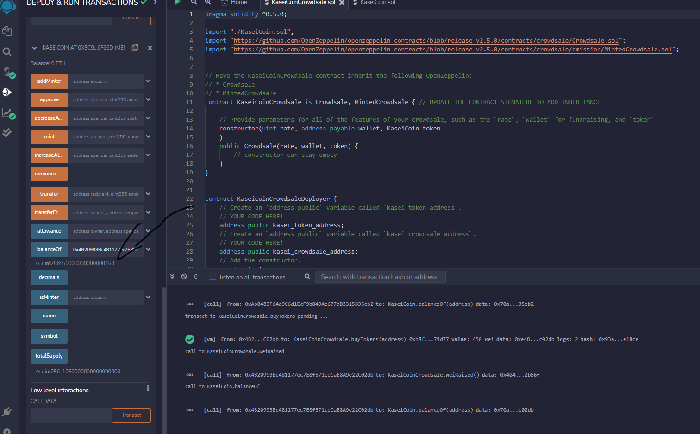

# Kaseicoin
---

Challenge 21 for fintech bootcamp through UC Berkeley. Using solidity to build an ERC-20 compliant token on a test Ethereum network using the remix IDE. Specifically this repo, and the `.sol` files use the OpenZeppelin solidity library to inherit the attributes of ERC-20 compliant tokens. After creating the token in the `KaseiToken.sol` file, I created a crowdsale and a deployer contract inside the `KaseiCoinCrowdsale.sol` file using libraries from OpenZeppelin as well. This crowdsale deployer function allows the user to deploy the contracts from the deployer, which then automatically moves minting rights to the crowdsale contract so no one can mint new tokens other than sending wei to the contract via the 'buyTokens' function. Follow along in the screenshots below to see the compiled and deployed contracts in action.

---
## Results 

First I started compiling the KaseiCoin contract which you can see below,

Next we have a compiled screenshot of the crowdsale contract,

for this contract I was having issues using the 0.5.0 compiler due to an issue with one of the imported files, so I decided to just stick with the default compiler to avoid issues. Below we can see the full deployer contract sol file compiled

After compiling I deployed the contracts and had to manually make the remix IDE locate the token and crowdsale contracts after deploying the deployer contract. Once this was done, I could start minting some KAI tokens and checking the balances/WEI raised. the following screenshots show the results of a 450 wei purchase, as well as some other purchases that I did on other accounts. 

The photo above and below shows the same account buying 450 wei worth of KAI tokens, and then below this message we see the balance of that has ends in 450 wei. I did an earlier purchase of .05 ETH which is why the number is large.  

The image below shows WEI raised via the crowdsale vs the tokens minted on the contract, showing that the numbers match meaning so far no free tokens have been minted.

---
## Get setup

To run these contracts yourself simply copy the `KaseiCoinCrowdsale.sol` and `KaseiToken.sol`  files or clone the repo and copy the files there. Navigate to remix's website or a similar IDE and paste the contract code into .sol files. Compile and deploy the KaseiCoinCrowdsaleDeployer contract and start messing with it yourself. you will need to manually add the two other contracts to mint and view the token balance.
If you want to connect to ganache and use your local metamask to confirm transactions etc too follow along in the photos below. 

You will need the RPC network ID, as well as private keys for whatever address you want to connect. In metamask chose the network dropdown and add network, put in details for ganache network and use '1337' for chain ID. Once you have connected in metamask, chose the injected provider in the environment option on remix to connect to you metamask/ganache accounts. Make sure you add the ganache accounts using the private keys given by ganache and you should see your 100 ETH! Deploy the contracts like normal and you should be able to add the kai token using the contract address you get given!

Feel free to make any changes you desire! and reach out if you have any questions.

---

## Contributors

[Robin Thorsen](https://www.linkedin.com/in/robin-thorsen-079819120/) was the developer who worked on this project. 

---

## License

Apache 2.0 public License applied, feel free to clone and fork and use and reach out if you have questions. 

